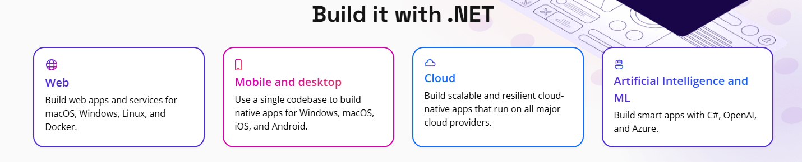

# Introduction to .Net

## What is .NET?

It's an open-source, cross-platform framework designed to create modern applications and robust cloud services. It empowers developers to build versatile, high-performance applications across different platforms with a unified development experience.

## Why Should We Use .NET?

.NET enables developers to build any app on any platform! Web, mobile, desktop, cloud, or AI-powered—across all major platforms using shared skills and code. From scalable web services and cross-platform native apps to cloud-native solutions and intelligent systems with machine learning, .NET provides a unified, efficient, and cost-effective development experience.

<figure><figcaption></figcaption></figure>

### Support

.NET binaries, packages, and container images are provided and supported by organizations that participate in the .NET community, [build .NET from source](https://github.com/dotnet/dotnet), and offer regularly updated assets to their users. These organizations work together to enable developers to be productive and safe on Linux, macOS, and Windows.

#### Canonical

* Offers commercial support for .NET on Ubuntu:
  * **.NET 6 and 8** supported on Ubuntu 22.04 and later.

#### Microsoft

* Provides stable builds and extensive commercial support across multiple operating systems as outlined in the [.NET support policy](https://github.com/dotnet/core/blob/main/support.md).
* Offers official container images optimized for various operating systems.

#### Red Hat

* Supports .NET fully on Red Hat Enterprise Linux following the official [.NET lifecycle policy](https://github.com/dotnet/core/blob/main/support.md).

#### Strong Global Community

.NET boasts a vibrant global community, contributing actively through GitHub repositories such as [dotnet/core](https://github.com/dotnet/core) and [.NET repositories](https://github.com/dotnet).

* Community builds available for FreeBSD, Linux, and macOS.
* Supported Linux derivatives include:
  * **RHEL-family**: AlmaLinux, CentOS Stream, Oracle Linux, Rocky Linux
  * **Ubuntu family**: Linux Mint

More information about the community can be found on the [.NET Community page](https://dotnet.microsoft.com/en-us/platform/community).

### Exceptional Performance

.NET is recognized for its remarkable speed and efficiency. For instance, in the [TechEmpower's Round](https://www.techempower.com/benchmarks/#section=data-r23\&hw=ph\&test=fortune) 23 Fortunes test, which evaluates a web application's performance in querying databases and rendering HTML server-side, .NET consistently ranks highly.

<figure><figcaption></figcaption></figure>

### Multi-language Support

.NET supports multiple programming languages, enabling developers to use their preferred coding style and paradigms. Prominent languages include:

* C#
* F#
* Visual Basic (VB)

This multi-language approach allows for greater flexibility and more intuitive application development.
