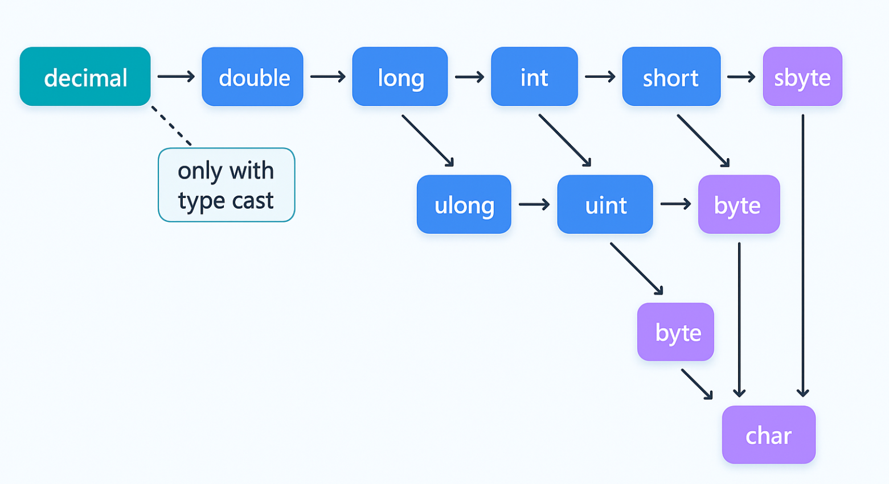

# Implicit and Explicit Conversions (Casting)

C# supports two types of conversions:

* **Implicit Conversions** (automatic)
* **Explicit Conversions** (require casting)

Understanding these conversions is crucial for writing robust and error-free code.

### Implicit Conversions

Implicit conversions are handled automatically by the compiler, without data loss.

```csharp
int num = 100;
long bigNum = num; // Implicit conversion from int to long
```

#### Conversion Diagram

<figure><figcaption></figcaption></figure>

### Explicit Conversions

Explicit conversions require casting because they involve potential data loss, overflow, or precision reduction.

**Syntax:**

```csharp
targetType variable = (targetType)sourceVariable;
```

```csharp
double price = 9.99;
int intPrice = (int)price; // Explicit cast required, decimal part is lost
```

#### When Explicit Conversion is Necessary

* Converting floating-point to integral types (possible data loss).
* Converting larger numeric types to smaller ones (possible overflow).
* Converting `double` to `decimal` due to potential precision differences.

```csharp
double measurement = 5.25;
decimal preciseMeasurement = (decimal)measurement;
```


#### Practical Considerations

**Data Loss:** Be aware explicit casting can truncate data or lose precision.

**Overflow:** Ensure the value fits within the target type's range to avoid runtime errors.


### Helper Methods for Safe Conversions

To handle conversions safely, especially from strings to numeric types, C# provides helper methods such as those from the `Convert` class and the `TryParse` methods.

#### Example using `Convert` class:

```csharp
string value = "150";
try
{
    int number = Convert.ToInt32(value);
    Console.WriteLine($"Conversion successful: {number}");
}
catch (FormatException)
{
    Console.WriteLine("Conversion failed: Input was not in a correct format.");
}
catch (OverflowException)
{
    Console.WriteLine("Conversion failed: Input was outside the range of an int.");
}
```

#### Example using `TryParse`:

The `TryParse` method is highly recommended as it avoids exceptions and provides safer parsing:

```csharp
string decimalValue = "34.89";
if (decimal.TryParse(decimalValue, out decimal price))
{
    Console.WriteLine($"Parsed price: {price:C}");
}
else
{
    Console.WriteLine("Failed to parse decimal value.");
}
```

These helper methods ensure your conversions handle errors gracefully and robustly.

### Summary

| Conversion Type | Description                                 | Safety         | Example          |
| --------------- | ------------------------------------------- | -------------- | ---------------- |
| Implicit        | Automatic, no data loss, larger type target | Safe           | `int` → `long`   |
| Explicit        | Requires casting, potential data loss       | Caution needed | `double` → `int` |

By mastering both implicit and explicit conversions, you can efficiently manage type compatibility and data integrity in your C# applications.
