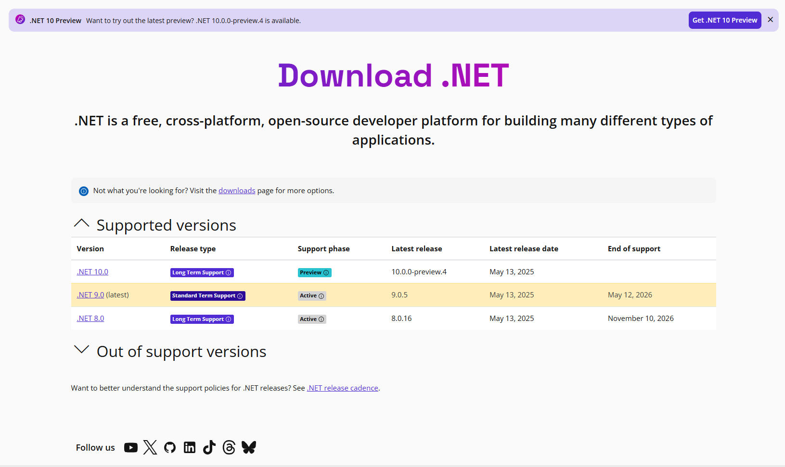

# Install on macOS

1. Go to [dotnet.microsoft.com/download/dotnet](https://dotnet.microsoft.com/download/dotnet).
2. Choose the latest version (e.g., **.NET 9.0**).
3. Under **SDK**, find the **macOS** row.
   * Select **Arm64** for Apple Silicon (M1, M2, M3).
   * Select **x64** for Intel-based Macs.
4. Download and run the `.pkg` installer.
5. Follow the on-screen installation steps.

***

<figure><figcaption></figcaption></figure>

#### Verify Installation

Open **Command Prompt** and run:

```
dotnet --version
```

This shows the installed .NET SDK version.
