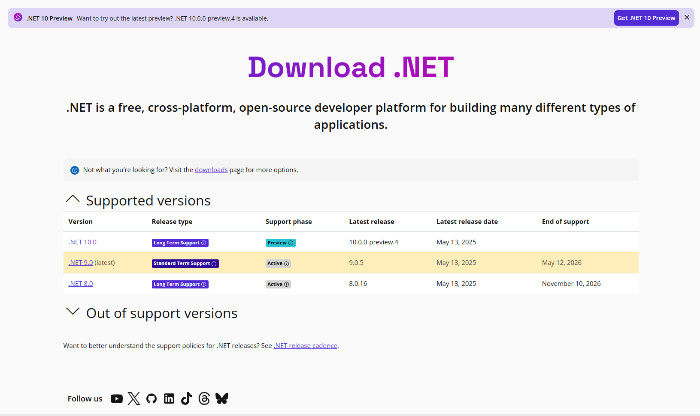

# Install on windows

1. Go to [dotnet.microsoft.com/download/dotnet](https://dotnet.microsoft.com/download/dotnet)
2. Choose your desired version (e.g., **.NET 9.0**).
3. Under **SDK or Runtime**, download the **Windows x64 Installer**.
4. Run the downloaded `.exe` and complete the installation.

***

<figure><figcaption></figcaption></figure>

#### Verify Installation

Open **Command Prompt** and run:

```bash
dotnet --version
```

This shows the installed .NET SDK version.
