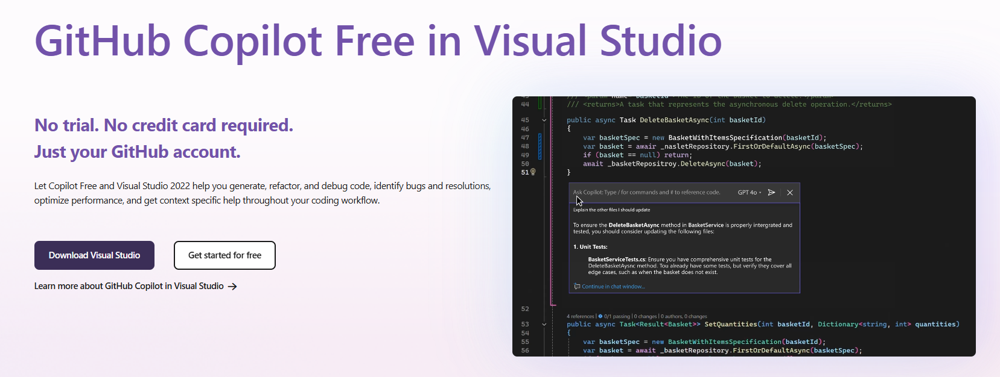

# Recommended IDEs

Choosing the right IDE can significantly improve your .NET development experience. Here are the top three IDEs we recommend, starting with the most powerful option.

### JetBrains Rider (Recommended)

JetBrains Rider is a fast, cross-platform .NET IDE packed with powerful features for modern development. It combines the IntelliJ platform with ReSharper’s rich .NET tooling.

**Why Choose Rider?**

* Outstanding code navigation and refactoring
* Built-in support for .NET, ASP.NET Core, Blazor, Unity, Xamarin, and more
* Integrated version control, Docker, terminal, and database tools
* Works on Windows, Linux, and macOS

🔗 [Download Rider](https://www.jetbrains.com/rider/)

<figure><figcaption></figcaption></figure>

### Visual Studio

Visual Studio is Microsoft’s flagship IDE for .NET development. It's feature-rich and ideal for large-scale enterprise applications, with deep integration into Microsoft’s ecosystem.

**Key Benefits:**

* Best-in-class support for Windows desktop apps, web APIs, Azure, and MAUI
* Built-in designers, profilers, and test runners
* Ideal for beginners and professionals alike

🔗 [Download Visual Studio](https://visualstudio.microsoft.com/downloads/)

<figure><figcaption></figcaption></figure>

### Visual Studio Code

Visual Studio Code is a lightweight and extensible source code editor. With the right extensions, it becomes a capable environment for C# and .NET development.

**Use it when:**

* You prefer speed and flexibility
* You’re writing scripts or smaller apps
* You want a customizable dev setup
* Install the **C# Dev Kit** for full .NET support

🔗 [Download VS Code](https://code.visualstudio.com/)

🔗 [Install the C# Dev Kit](https://marketplace.visualstudio.com/items?itemName=ms-dotnettools.csdevkit)
